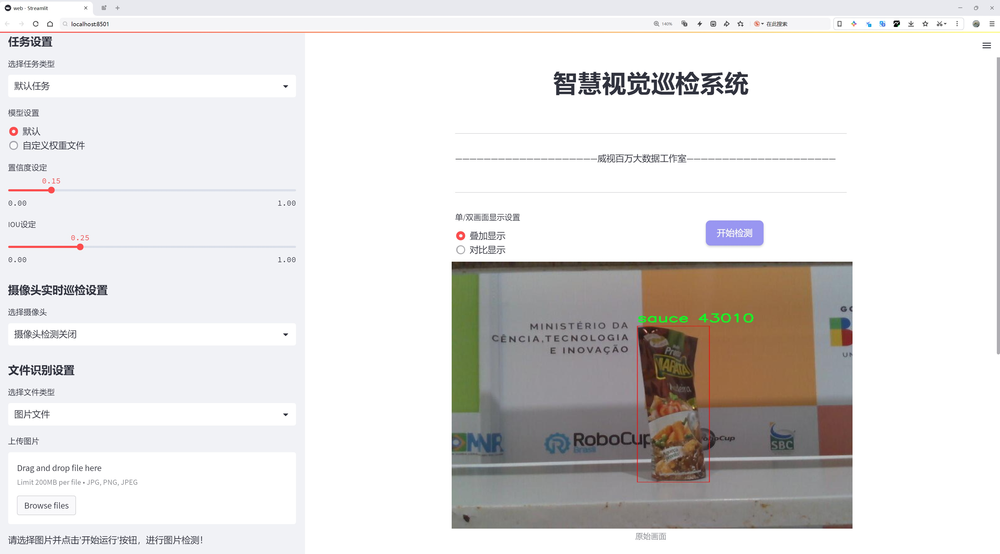
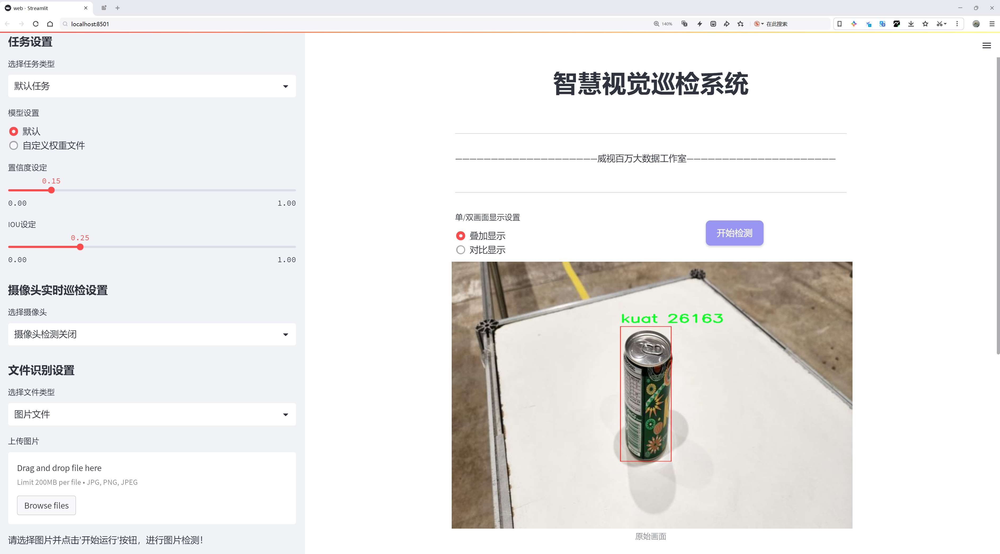
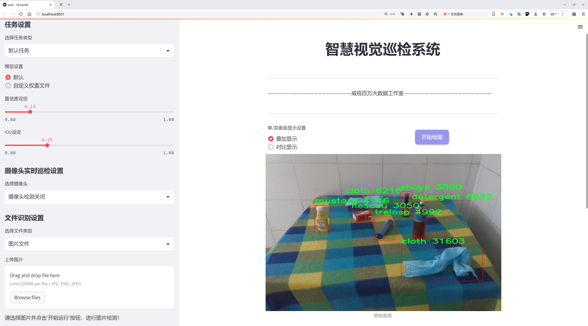
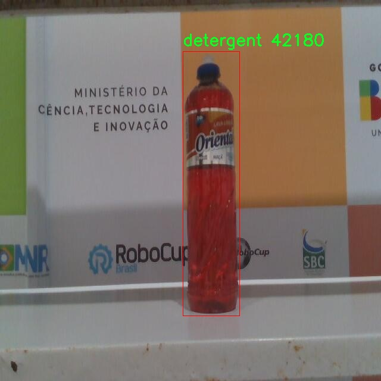
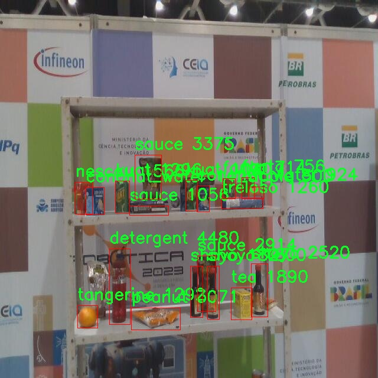
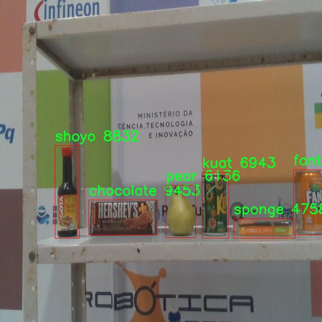
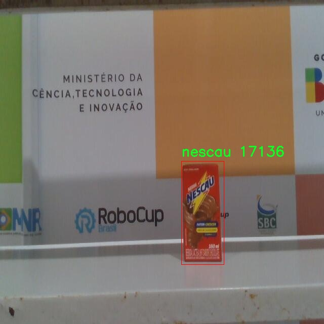
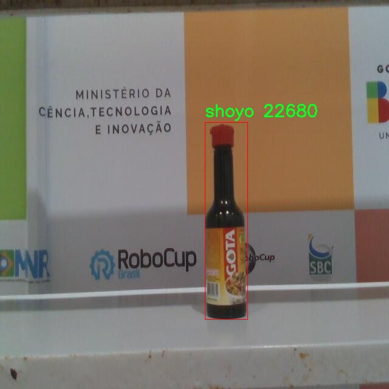

# 厨房常见食品佐料检测系统源码分享
 # [一条龙教学YOLOV8标注好的数据集一键训练_70+全套改进创新点发刊_Web前端展示]

### 1.研究背景与意义

项目参考[AAAI Association for the Advancement of Artificial Intelligence](https://gitee.com/qunmasj/projects)

项目来源[AACV Association for the Advancement of Computer Vision](https://kdocs.cn/l/cszuIiCKVNis)

研究背景与意义

随着人们生活水平的提高，厨房作为家庭生活的重要场所，其功能不仅限于烹饪，更多地成为了家庭成员交流、分享和创造美好生活的空间。在这一背景下，厨房中的食品及佐料的管理与使用显得尤为重要。传统的厨房管理方式往往依赖于人工记录和记忆，这不仅容易导致遗漏和错误，还可能造成食品浪费和安全隐患。因此，开发一种智能化的厨房食品佐料检测系统显得尤为必要。

近年来，计算机视觉技术的快速发展为智能厨房的实现提供了新的可能性。YOLO（You Only Look Once）系列算法作为一种高效的目标检测方法，因其在实时性和准确性上的优越表现，广泛应用于各类物体检测任务。YOLOv8作为该系列的最新版本，进一步提升了目标检测的性能，尤其在复杂环境下的检测能力。因此，基于改进YOLOv8的厨房常见食品佐料检测系统的研究，具有重要的理论价值和实际意义。

本研究所使用的数据集包含606张图像，涵盖18种常见的厨房食品和佐料，包括苹果、巧克力、椰子水、洗涤剂、饮料、明胶、芥末、花生、酱油等。这些食品和佐料的多样性为系统的训练和测试提供了丰富的样本，有助于提高模型的泛化能力和实用性。通过对这些数据的分析和处理，研究者可以深入了解不同食品的特征，从而优化目标检测算法的性能，提升系统的准确性和鲁棒性。

在实际应用中，基于改进YOLOv8的厨房食品佐料检测系统能够实现对厨房中各类食品的自动识别和分类，帮助用户快速找到所需的佐料，减少寻找时间，提高烹饪效率。此外，该系统还可以与智能家居设备进行联动，实时监测食品的存量和保质期，提醒用户及时补充和处理过期食品，从而有效减少食品浪费，提升家庭的资源利用效率。

从社会层面来看，智能厨房食品佐料检测系统的推广应用将有助于提升公众的食品安全意识和管理水平。通过智能化的手段，用户能够更好地掌握食品的使用情况，避免因误食过期或不当存储的食品而引发的健康问题。同时，该系统也为食品行业的智能化发展提供了新的思路，推动了相关技术的进步和应用。

综上所述，基于改进YOLOv8的厨房常见食品佐料检测系统的研究，不仅具有重要的学术价值，也具备广泛的社会应用前景。通过该系统的开发与应用，能够有效提升厨房管理的智能化水平，为家庭生活带来便利，促进食品安全和资源的合理利用。

### 2.图片演示







##### 注意：由于此博客编辑较早，上面“2.图片演示”和“3.视频演示”展示的系统图片或者视频可能为老版本，新版本在老版本的基础上升级如下：（实际效果以升级的新版本为准）

  （1）适配了YOLOV8的“目标检测”模型和“实例分割”模型，通过加载相应的权重（.pt）文件即可自适应加载模型。

  （2）支持“图片识别”、“视频识别”、“摄像头实时识别”三种识别模式。

  （3）支持“图片识别”、“视频识别”、“摄像头实时识别”三种识别结果保存导出，解决手动导出（容易卡顿出现爆内存）存在的问题，识别完自动保存结果并导出到tempDir中。

  （4）支持Web前端系统中的标题、背景图等自定义修改，后面提供修改教程。

  另外本项目提供训练的数据集和训练教程,暂不提供权重文件（best.pt）,需要您按照教程进行训练后实现图片演示和Web前端界面演示的效果。

### 3.视频演示

[3.1 视频演示](https://www.bilibili.com/video/BV1CD23YhEpj/)

### 4.数据集信息展示

##### 4.1 本项目数据集详细数据（类别数＆类别名）

nc: 18
names: ['apple', 'chocolate', 'cloth', 'cononut_water', 'detergent', 'fanta', 'gelatin', 'kuat', 'mustard', 'nescau', 'peanut', 'pear', 'sauce', 'shoyo', 'sponge', 'tangerine', 'tea', 'treloso']


##### 4.2 本项目数据集信息介绍

数据集信息展示

在本研究中，我们使用的数据集名为“dataset_final”，该数据集专门设计用于训练和改进YOLOv8模型，以实现厨房常见食品佐料的高效检测。随着智能厨房设备的普及，食品识别技术的需求日益增长，而“dataset_final”正是为了满足这一需求而构建的。该数据集包含18个类别，涵盖了多种厨房常见食品和调料，旨在为模型提供丰富的训练样本，从而提高其在实际应用中的准确性和鲁棒性。

数据集中包含的类别包括：苹果（apple）、巧克力（chocolate）、布料（cloth）、椰子水（coconut_water）、洗涤剂（detergent）、芬达（fanta）、明胶（gelatin）、Kuat饮料（kuat）、芥末（mustard）、Nescau饮料（nescau）、花生（peanut）、梨（pear）、酱油（shoyo）、海绵（sponge）、橘子（tangerine）、茶（tea）以及Treloso饮料（treloso）。这些类别的选择不仅考虑了食品的多样性，还兼顾了日常厨房使用频率，确保模型在实际应用中能够识别出用户常见的食品和调料。

“dataset_final”数据集的构建过程严格遵循数据标注的标准化流程。每个类别的样本均经过精心挑选和标注，确保其在图像中的位置、大小和形状都能准确反映真实情况。数据集中的图像涵盖了不同的拍摄角度、光照条件和背景环境，旨在增强模型的泛化能力，使其能够在各种实际场景中有效识别目标。

此外，为了提高模型的训练效果，我们还对数据集进行了数据增强处理，包括旋转、缩放、裁剪和颜色调整等。这些处理不仅增加了数据集的多样性，还有效提升了模型对不同环境和条件下食品的识别能力。通过这种方式，我们希望模型能够更好地适应复杂的厨房环境，准确识别出各种食品和调料，从而为用户提供更为智能化的厨房助手服务。

在训练过程中，我们将“dataset_final”数据集与YOLOv8模型相结合，利用其先进的深度学习算法，进行多轮迭代训练。通过不断优化模型参数和结构，我们期望能够显著提高食品佐料的检测精度和速度。最终，经过充分训练的模型将能够在实际应用中实时识别厨房中的各种食品，帮助用户更方便地进行烹饪和食品管理。

总之，“dataset_final”数据集为本研究提供了坚实的基础，涵盖了多样化的食品类别和丰富的样本特征，确保了模型训练的有效性和可靠性。通过对该数据集的深入分析和应用，我们期待在厨房食品佐料检测领域取得显著的进展，为智能厨房技术的发展贡献一份力量。











### 5.全套项目环境部署视频教程（零基础手把手教学）

[5.1 环境部署教程链接（零基础手把手教学）](https://www.ixigua.com/7404473917358506534?logTag=c807d0cbc21c0ef59de5)


[5.2 安装Python虚拟环境创建和依赖库安装视频教程链接（零基础手把手教学）](https://www.ixigua.com/7404474678003106304?logTag=1f1041108cd1f708b01a)

### 6.手把手YOLOV8训练视频教程（零基础小白有手就能学会）

[6.1 手把手YOLOV8训练视频教程（零基础小白有手就能学会）](https://www.ixigua.com/7404477157818401292?logTag=d31a2dfd1983c9668658)


按照上面的训练视频教程链接加载项目提供的数据集，运行train.py即可开始训练



     Epoch   gpu_mem       box       obj       cls    labels  img_size
     1/200     20.8G   0.01576   0.01955  0.007536        22      1280: 100%|██████████| 849/849 [14:42<00:00,  1.04s/it]
               Class     Images     Labels          P          R     mAP@.5 mAP@.5:.95: 100%|██████████| 213/213 [01:14<00:00,  2.87it/s]
                 all       3395      17314      0.994      0.957      0.0957      0.0843

     Epoch   gpu_mem       box       obj       cls    labels  img_size
     2/200     20.8G   0.01578   0.01923  0.007006        22      1280: 100%|██████████| 849/849 [14:44<00:00,  1.04s/it]
               Class     Images     Labels          P          R     mAP@.5 mAP@.5:.95: 100%|██████████| 213/213 [01:12<00:00,  2.95it/s]
                 all       3395      17314      0.996      0.956      0.0957      0.0845

     Epoch   gpu_mem       box       obj       cls    labels  img_size
     3/200     20.8G   0.01561    0.0191  0.006895        27      1280: 100%|██████████| 849/849 [10:56<00:00,  1.29it/s]
               Class     Images     Labels          P          R     mAP@.5 mAP@.5:.95: 100%|███████   | 187/213 [00:52<00:00,  4.04it/s]
                 all       3395      17314      0.996      0.957      0.0957      0.0845


### 7.70+种全套YOLOV8创新点代码加载调参视频教程（一键加载写好的改进模型的配置文件）

[7.1 70+种全套YOLOV8创新点代码加载调参视频教程（一键加载写好的改进模型的配置文件）](https://www.ixigua.com/7404478314661806627?logTag=29066f8288e3f4eea3a4)

### 8.70+种全套YOLOV8创新点原理讲解（非科班也可以轻松写刊发刊，V10版本正在科研待更新）

#### 由于篇幅限制，每个创新点的具体原理讲解就不一一展开，具体见下列网址中的创新点对应子项目的技术原理博客网址【Blog】：


[8.1 70+种全套YOLOV8创新点原理讲解链接](https://gitee.com/qunmasj/good)

#### 部分改进原理讲解(完整的改进原理见上图和技术博客链接)【如果此小节的图加载失败可以通过CSDN或者Github搜索该博客的标题访问原始博客，原始博客图片显示正常】

### YOLOv8简介
继YOLOv5之后,Ultralytics公司在2023年1月发布了YOLOv8,该版本可以用于执行目标检测、实例分割和图像分类任务。整个网络结构由4部分组成:输入图像, Backbone主干网络获得图像的特征图, Head检测头预测目标对象和位置, Neck融合不同层的特征并将图像特征传递到预测层。
1)相比于YOLOv5和 YOLOv7算法,YOLOv8在训练时间和检测精度上得到极大提升,而且模型的权重文件只有6 MB,可以部署到任一嵌入式设备中,它凭借自身快速、高效的性能可以很好地满足实时检测的需求。
2)由于YOLOv8算法是YOLOv5的继承版本，对应提供了N、S、 M、L、X 等不同尺度的模型,用于满足不同场景的需求,在精度得到大幅提升的同时,能流畅地训练,并且能安装在各种硬件平台上运行。
3)在输入端,YOLOv8算法使用了Mosaic数据增强[15]、自适应锚框计算[16]等方法。Mosaic数据增强是通过随机缩放、随机裁剪、随机排布的方式进行拼接,丰富检测数据集。自适应锚框计算是网络在初始锚框的基础上输出预测框,通过差值计算、反向更新等操作计算出最佳锚框值。
4)在输出端,YOLOv8算法使用解耦头替换了以往的耦合头,将分类和回归解耦为两个独立的分支,通过解耦使各个任务更加专注,从而解决复杂场景下定位不准及分类错误的问题。


### OREPA：在线卷积重参数化
卷积神经网络(CNNs)已经在许多计算机视觉任务的应用成功，包括图像分类、目标检测、语义分割等。精度和模型效率之间的权衡也已被广泛讨论。

一般来说，一个精度较高的模型通常需要一个更复杂的块，一个更宽或更深的结构。然而，这样的模型总是太重，无法部署，特别是在硬件性能有限、需要实时推理的场景下。考虑到效率，更小、更紧凑和更快的模型自然是首选。

为了获得一个部署友好且高精度的模型，有研究者提出了基于结构重参数化的方法来释放性能。在这些方法中，模型在训练阶段和推理阶段有不同的结构。具体来说，使用复杂的训练阶段拓扑，即重参数化的块，来提高性能。训练结束后，通过等效变换将一个复杂的块重参为成一个单一的线性层。重参后的模型通常具有一个整洁架构模型，例如，通常是一个类似VGG的或一个类似ResNet的结构。从这个角度来看，重参化策略可以在不引入额外的推理时间成本的情况下提高模型的性能。


BN层是重构模型的关键组成部分。在一个重新解析块(图1(b))中，在每个卷积层之后立即添加一个BN层。可以观察到，去除这些BN层会导致的性能退化。然而，当考虑到效率时，这种BN层的使用出乎意料地在训练阶段带来了巨大的计算开销。在推理阶段，复杂的块可以被压缩成一个卷积层。但是，在训练过程中，BN层是非线性的，也就是说，它们将特征映射除以它的标准差，这就阻止了合并整个块。因此，存在大量的中间计算操作(large FLOPS)和缓冲特征映射(high memory usage)。更糟糕的是，这么高的训练预算使得很难探索更复杂和可能更强的重参块。很自然地，下面的问题就出现了：

为什么标准化在重参中这么重要？

通过分析和实验，作者认为BN层中的尺度因子最重要，因为它们能够使不同分支的优化方向多样化。

基于观察结果，作者提出了在线重参化(OREPA)(图1(c))，这是一个两阶段的pipeline，使之能够简化复杂的training-time re-param block。

在第一阶段，block linearization，去除所有的非线性BN层，并引入线性缩放层。这些层与BN层具有相似的性质，因此它们使不同分支的优化多样化。此外，这些层都是线性的，可以在训练过程中合并成卷积层。

第二阶段，block squeezing，将复杂的线性块简化为单一的卷积层。OREPA通过减少由中间计算层引起的计算和存储开销，显著降低了训练成本，对性能只有非常小的影响。

此外，高效化使得探索更复杂的重参化拓扑成为可能。为了验证这一点，作者进一步提出了几个重参化的组件，以获得更好的性能。

在ImageNet分类任务上评估了所提出的OREPA。与最先进的修复模型相比，OREPA将额外的训练时间GPU内存成本降低了65%到75%，并将训练过程加快了1.5-2.3倍。同时，OREPA-ResNet和OREPA-VGG的性能始终优于+0.2%∼+0.6%之前的DBB和RepVGG方法。同时作者还评估了在下游任务上的OREPA，即目标检测和语义分割。作者发现OREPA可以在这些任务上也可以带来性能的提高。

提出了在线卷积重参化(OREPA)策略，这极大地提高了重参化模型的训练效率，并使探索更强的重参化块成为可能；

通过对重参化模型工作机制的分析，用引入的线性尺度层代替BN层，这仍然提供了不同的优化方向，并保持了表示能力;

在各种视觉任务上的实验表明，OREPA在准确性和训练效率方面都优于以前的重参化模型(DBB/RepVGG)。


#### 结构重参化
结构重参化最近被重视并应用于许多计算机视觉任务，如紧凑模型设计、架构搜索和剪枝。重参化意味着不同的架构可以通过参数的等价转换来相互转换。例如，1×1卷积的一个分支和3×3卷积的一个分支，可以转移到3×3卷积的单个分支中。在训练阶段，设计了多分支和多层拓扑来取代普通的线性层(如conv或全连接层)来增强模型。Cao等讨论了如何在训练过程中合并深度可分离卷积核。然后在推理过程中，将训练时间的复杂模型转移到简单模型中，以便于更快的推理。

在受益于复杂的training-time拓扑，同时，当前的重参化方法训练使用不可忽略的额外计算成本。当块变得更复杂以变得更强的表示时，GPU内存利用率和训练时间将会越来越长，最终走向不可接受。与以往的重参化方法不同，本文更多地关注训练成本。提出了一种通用的在线卷积重参化策略，使training-time的结构重参化成为可能。


#### Normalization
BN被提出来缓解训练非常深度神经网络时的梯度消失问题。人们认为BN层是非常重要的，因为它们平滑了损失。最近关于无BN神经网络的研究声称，BN层并不是不可或缺的。通过良好的初始化和适当的正则化，可以优雅地去除BN层。

对于重参化模型，作者认为重参化块中的BN层是关键的。无BN的变体将会出现性能下降。然而，BN层是非线性的，也就是说，它们将特征图除以它的标准差，这阻止了在线合并块。为了使在线重参化可行，作者去掉了重参块中的所有BN层，并引入了BN层的线性替代方法，即线性缩放层。

#### 卷积分解
标准卷积层计算比较密集，导致大的FLOPs和参数量。因此，卷积分解方法被提出，并广泛应用于移动设备的轻量化模型中。重参化方法也可以看作是卷积分解的某种形式，但它更倾向于更复杂的拓扑结构。本文的方法的不同之处在于，在kernel-level上分解卷积，而不是在structure level。

#### 在线重参化
在本节中，首先，分析了关键组件，即重参化模型中的BN层，在此基础上提出了在线重参化(OREPA)，旨在大大减少再参数化模型的训练时间预算。OREPA能够将复杂的训练时间块简化为一个卷积层，并保持了较高的精度。

OREPA的整体pipeline如图所示，它包括一个Block Linearization阶段和一个Block Squeezing阶段。


参考该博客通过分析多层和多分支结构的优化多样性，深入研究了重参化的有效性，并证明了所提出的线性缩放层和BN层具有相似的效果。

最后，随着训练预算的减少，进一步探索了更多的组件，以实现更强的重参化模型，成本略有增加。

#### 重参化中的Normalization
作者认为中间BN层是重参化过程中多层和多分支结构的关键组成部分。以SoTA模型DBB和RepVGG为例，去除这些层会导致严重的性能下降，如表1所示。


这种观察结果也得到了Ding等人的实验支持。因此，作者认为中间的BN层对于重参化模型的性能是必不可少的。

然而，中间BN层的使用带来了更高的训练预算。作者注意到，在推理阶段，重参化块中的所有中间操作都是线性的，因此可以合并成一个卷积层，从而形成一个简单的结构。

但在训练过程中，BN层是非线性的，即它们将特征映射除以其标准差。因此，中间操作应该单独计算，这将导致更高的计算和内存成本。更糟糕的是，如此高的成本将阻止探索更强大的训练模块。

#### Block Linearization
如3.1中所述，中间的BN层阻止了在训练过程中合并单独的层。然而，由于性能问题，直接删除它们并不简单。为了解决这一困境，作者引入了channel级线性尺度操作作为BN的线性替代方法。

缩放层包含一个可学习的向量，它在通道维度中缩放特征映射。线性缩放层具有与BN层相似的效果，它们都促进多分支向不同的方向进行优化，这是重参化时性能提高的关键。除了对性能的影响外，线性缩放层还可以在训练过程中进行合并，使在线重参化成为可能。


基于线性缩放层，作者修改了重参化块，如图所示。具体来说，块的线性化阶段由以下3个步骤组成：

首先，删除了所有的非线性层，即重参化块中的BN层

其次，为了保持优化的多样性，在每个分支的末尾添加了一个缩放层，这是BN的线性替代方法

最后，为了稳定训练过程，在所有分支的添加后添加一个BN层。

一旦完成线性化阶段，在重参化块中只存在线性层，这意味着可以在训练阶段合并块中的所有组件。

#### Block Squeezing
Block Squeezing步骤将计算和内存昂贵的中间特征映射上的操作转换为更经济的kernel上的操作。这意味着在计算和内存方面从减少到，其中、是特征图和卷积核的空间尺寸。

一般来说，无论线性重参化块是多么复杂，以下2个属性始终成立：

Block中的所有线性层，例如深度卷积、平均池化和所提出的线性缩放，都可以用带有相应参数的退化卷积层来表示;

Block可以由一系列并行分支表示，每个分支由一系列卷积层组成。

有了上述两个特性，如果可以将

多层（即顺序结构）

多分支（即并行结构）

简化为单一卷积，就可以压缩一个块。在下面的部分中，将展示如何简化顺序结构(图(a))和并行结构(图(b))。


### 9.系统功能展示（检测对象为举例，实际内容以本项目数据集为准）

图9.1.系统支持检测结果表格显示

  图9.2.系统支持置信度和IOU阈值手动调节

  图9.3.系统支持自定义加载权重文件best.pt(需要你通过步骤5中训练获得)

  图9.4.系统支持摄像头实时识别

  图9.5.系统支持图片识别

  图9.6.系统支持视频识别

  图9.7.系统支持识别结果文件自动保存

  图9.8.系统支持Excel导出检测结果数据


### 10.原始YOLOV8算法原理

原始YOLOv8算法原理

YOLOv8作为YOLO系列中的最新版本，代表了目标检测领域的一次重要进步。其设计理念旨在通过高效的网络结构和创新的训练策略，实现更快的检测速度和更高的检测精度。YOLOv8的架构由输入端、主干网络、颈部网络和头部网络四个主要部分构成，每个部分在整体性能中扮演着至关重要的角色。

在输入端，YOLOv8首先对输入图像进行预处理，以适应模型的输入要求。该过程包括Mosaic数据增强、自适应图像缩放和灰度填充等技术。这些预处理步骤不仅增强了数据的多样性，还提高了模型对不同场景的适应能力，进而提升了检测的鲁棒性。

主干网络是YOLOv8的核心部分，负责从输入图像中提取特征。与以往的YOLO版本相比，YOLOv8在主干网络中引入了C2f模块，该模块融合了YOLOv5中的C3结构和YOLOv7中的ELAN思想。C2f模块通过增加残差连接，增强了梯度流动，从而改善了特征提取的效果。主干网络中的卷积层使用批归一化和SiLUR激活函数，确保了网络在训练过程中的稳定性和收敛速度。此外，主干网络末尾的SPPFl模块通过三个最大池化层处理多尺度特征，进一步增强了网络的特征抽象能力。

颈部网络的设计基于PAN（Path Aggregation Network）结构，旨在有效融合来自不同尺度的特征图信息。通过上采样和下采样操作，颈部网络将多层特征进行整合，确保模型能够充分利用不同层次的信息。这种特征融合策略不仅提高了模型对目标的感知能力，还增强了对复杂场景的适应性。

在头部网络中，YOLOv8采用了解耦合的检测头结构，分别处理分类和回归任务。这种解耦合设计使得模型在处理目标检测时能够更高效地分配计算资源，进而提高了检测精度。YOLOv8还采用了Anchor-Free的方法，摒弃了传统的Anchor-Based检测方式，进一步提升了检测速度和精度。通过将分类和回归损失的计算分开，YOLOv8能够更灵活地调整模型参数，从而优化检测结果。

在训练过程中，YOLOv8引入了动态的Task-Aligned Assigner样本分配策略，旨在提高训练效率和模型性能。该策略通过对分类分数和回归分数进行加权，优化了正样本的匹配过程，确保模型在训练时能够更好地学习到目标的特征。此外，YOLOv8在损失计算方面也进行了创新，采用BCELoss作为分类损失，DFLLoss和CIoULoss作为回归损失，进一步提高了模型的学习能力和泛化能力。

YOLOv8的设计不仅关注模型的精度和速度，还考虑到了实际应用中的复杂性。在面对小目标检测时，YOLOv8仍然表现出一定的局限性。为了解决这一问题，研究者们提出了YOLOv8-WSSOD算法，通过引入BiFormer双层路由注意力机制和更小的检测头，提升了模型对小目标的感知能力。此外，GSConv和Slim-neck技术的引入也有效降低了计算量，同时保持了模型的精度。

总的来说，YOLOv8算法通过一系列创新的设计和策略，成功地在目标检测领域中实现了性能的提升。其独特的网络结构和高效的训练方法，使得YOLOv8不仅在速度上具有优势，同时在精度上也表现出色。随着YOLOv8的广泛应用，目标检测技术将迎来新的发展机遇，为各类智能应用提供更为强大的支持。


### 11.项目核心源码讲解（再也不用担心看不懂代码逻辑）

#### 11.1 70+种YOLOv8算法改进源码大全和调试加载训练教程（非必要）\ultralytics\nn\extra_modules\ops_dcnv3\functions\__init__.py

下面是对你提供的代码的核心部分进行分析和详细注释的结果：

```python
# --------------------------------------------------------
# InternImage
# Copyright (c) 2022 OpenGVLab
# Licensed under The MIT License [see LICENSE for details]
# --------------------------------------------------------

# 从当前包中导入 DCNv3Function 和 dcnv3_core_pytorch
# 这两个模块可能与深度学习中的可微分卷积（Deformable Convolution）相关
from .dcnv3_func import DCNv3Function, dcnv3_core_pytorch
```

### 代码分析与注释：

1. **版权声明**：
   - 代码开头包含版权信息，表明该代码属于 OpenGVLab，并且受 MIT 许可证保护。

2. **模块导入**：
   - `from .dcnv3_func import DCNv3Function, dcnv3_core_pytorch`：
     - 这一行代码从当前包（用`.`表示）中的 `dcnv3_func` 模块导入了两个核心功能：
       - `DCNv3Function`：可能是一个自定义的可微分卷积操作的实现，通常用于增强卷积神经网络的特征提取能力。
       - `dcnv3_core_pytorch`：可能是与 PyTorch 框架兼容的核心功能，提供了与 `DCNv3Function` 相关的底层实现。

### 总结：
这段代码的核心在于导入与可微分卷积相关的功能模块，为后续的深度学习模型构建提供基础。通过使用可微分卷积，模型能够更好地适应不同形状和尺寸的输入特征，提高了模型的灵活性和性能。

这个文件是一个Python模块的初始化文件，位于一个名为`ops_dcnv3`的目录下，属于`ultralytics`项目的一部分。文件开头包含了一些版权信息，表明该代码是由OpenGVLab于2022年开发的，并且遵循MIT许可证，这意味着该代码可以自由使用和修改，只要遵循许可证的条款。

在文件的主体部分，使用了`from ... import ...`语句来导入其他模块中的功能。具体来说，它从同一目录下的`dcnv3_func`模块中导入了`DCNv3Function`和`dcnv3_core_pytorch`这两个功能。这表明该模块可能与深度学习中的可变形卷积（Deformable Convolution）相关，因为DCNv3通常是指一种改进的可变形卷积方法。

通过这个初始化文件，用户在导入`ops_dcnv3`模块时，可以直接使用`DCNv3Function`和`dcnv3_core_pytorch`，这使得模块的使用更加方便和直观。总的来说，这个文件的主要作用是组织和管理模块内的功能，使得其他部分的代码能够更容易地访问到这些功能。

#### 11.2 ui.py

以下是经过简化并注释的核心代码部分：

```python
import sys
import subprocess

def run_script(script_path):
    """
    使用当前 Python 环境运行指定的脚本。

    Args:
        script_path (str): 要运行的脚本路径

    Returns:
        None
    """
    # 获取当前 Python 解释器的路径
    python_path = sys.executable

    # 构建运行命令，使用 streamlit 运行指定的脚本
    command = f'"{python_path}" -m streamlit run "{script_path}"'

    # 执行命令，并等待其完成
    result = subprocess.run(command, shell=True)
    
    # 检查命令执行结果，如果返回码不为0，则表示出错
    if result.returncode != 0:
        print("脚本运行出错。")

# 主程序入口
if __name__ == "__main__":
    # 指定要运行的脚本路径
    script_path = "web.py"  # 这里可以直接指定脚本名

    # 调用函数运行脚本
    run_script(script_path)
```

### 代码注释说明：
1. **导入模块**：
   - `sys`：用于获取当前 Python 解释器的路径。
   - `subprocess`：用于执行外部命令。

2. **run_script 函数**：
   - 接受一个参数 `script_path`，表示要运行的 Python 脚本的路径。
   - 使用 `sys.executable` 获取当前 Python 解释器的路径，以确保脚本在正确的环境中运行。
   - 构建一个命令字符串，使用 `streamlit` 模块运行指定的脚本。
   - 使用 `subprocess.run` 执行命令，并等待其完成。
   - 检查命令的返回码，如果不为0，打印错误信息。

3. **主程序入口**：
   - 当脚本作为主程序运行时，指定要运行的脚本路径，并调用 `run_script` 函数执行该脚本。

这个程序文件名为 `ui.py`，其主要功能是使用当前的 Python 环境来运行一个指定的脚本。代码首先导入了必要的模块，包括 `sys`、`os` 和 `subprocess`，以及一个自定义模块 `QtFusion.path` 中的 `abs_path` 函数。

在 `run_script` 函数中，程序接收一个参数 `script_path`，这个参数是要运行的脚本的路径。函数内部首先获取当前 Python 解释器的路径，存储在 `python_path` 变量中。接着，构建一个命令字符串 `command`，这个命令使用 `streamlit` 模块来运行指定的脚本。具体来说，命令的格式是 `"python_path" -m streamlit run "script_path"`。

随后，程序使用 `subprocess.run` 方法来执行这个命令。这个方法的 `shell=True` 参数表示在一个新的 shell 中执行命令。执行后，程序检查命令的返回码，如果返回码不为 0，表示脚本运行出错，程序会打印出错误信息。

在文件的最后部分，使用 `if __name__ == "__main__":` 语句来确保只有在直接运行这个文件时才会执行下面的代码。这里指定了要运行的脚本路径为 `web.py`，并调用 `run_script` 函数来执行这个脚本。

总的来说，这个程序的作用是方便地在当前 Python 环境中运行一个 Streamlit 应用脚本，确保用户能够通过简单的调用来启动他们的应用。

#### 11.3 code\ultralytics\trackers\byte_tracker.py

以下是代码中最核心的部分，并附上详细的中文注释：

```python
import numpy as np
from .basetrack import BaseTrack, TrackState
from .utils import matching
from .utils.kalman_filter import KalmanFilterXYAH

class STrack(BaseTrack):
    """
    单目标跟踪表示，使用卡尔曼滤波进行状态估计。

    该类负责存储有关单个跟踪的所有信息，并根据卡尔曼滤波器执行状态更新和预测。
    """

    shared_kalman = KalmanFilterXYAH()  # 所有STrack实例共享的卡尔曼滤波器

    def __init__(self, tlwh, score, cls):
        """初始化新的STrack实例。"""
        super().__init__()
        # 将输入的边界框格式转换为tlwh格式并存储
        self._tlwh = np.asarray(self.tlbr_to_tlwh(tlwh[:-1]), dtype=np.float32)
        self.kalman_filter = None  # 特定对象跟踪的卡尔曼滤波器实例
        self.mean, self.covariance = None, None  # 状态估计的均值和协方差
        self.is_activated = False  # 跟踪是否被激活的标志

        self.score = score  # 跟踪的置信度分数
        self.tracklet_len = 0  # 跟踪片段的长度
        self.cls = cls  # 对象的类别标签
        self.idx = tlwh[-1]  # 对象的索引

    def predict(self):
        """使用卡尔曼滤波器预测对象的下一个状态。"""
        mean_state = self.mean.copy()  # 复制当前的均值状态
        if self.state != TrackState.Tracked:  # 如果状态不是跟踪状态
            mean_state[7] = 0  # 将速度设置为0
        # 使用卡尔曼滤波器进行预测
        self.mean, self.covariance = self.kalman_filter.predict(mean_state, self.covariance)

    def activate(self, kalman_filter, frame_id):
        """启动新的跟踪片段。"""
        self.kalman_filter = kalman_filter  # 设置卡尔曼滤波器
        self.track_id = self.next_id()  # 获取新的跟踪ID
        # 初始化均值和协方差
        self.mean, self.covariance = self.kalman_filter.initiate(self.convert_coords(self._tlwh))

        self.tracklet_len = 0  # 重置跟踪片段长度
        self.state = TrackState.Tracked  # 设置状态为跟踪
        if frame_id == 1:
            self.is_activated = True  # 如果是第一帧，激活跟踪
        self.frame_id = frame_id  # 设置当前帧ID
        self.start_frame = frame_id  # 设置开始帧ID

    def update(self, new_track, frame_id):
        """
        更新匹配跟踪的状态。

        参数:
            new_track (STrack): 包含更新信息的新跟踪。
            frame_id (int): 当前帧的ID。
        """
        self.frame_id = frame_id  # 更新当前帧ID
        self.tracklet_len += 1  # 增加跟踪片段长度

        new_tlwh = new_track.tlwh  # 获取新的边界框
        # 使用卡尔曼滤波器更新均值和协方差
        self.mean, self.covariance = self.kalman_filter.update(
            self.mean, self.covariance, self.convert_coords(new_tlwh)
        )
        self.state = TrackState.Tracked  # 设置状态为跟踪
        self.is_activated = True  # 激活跟踪

        self.score = new_track.score  # 更新置信度分数
        self.cls = new_track.cls  # 更新类别标签
        self.idx = new_track.idx  # 更新索引

    @property
    def tlwh(self):
        """获取当前边界框位置（左上角x，左上角y，宽度，高度）。"""
        if self.mean is None:
            return self._tlwh.copy()  # 如果均值为None，返回初始值
        ret = self.mean[:4].copy()  # 复制均值的前四个元素
        ret[2] *= ret[3]  # 计算宽度
        ret[:2] -= ret[2:] / 2  # 计算左上角坐标
        return ret

    @staticmethod
    def tlwh_to_xyah(tlwh):
        """将边界框转换为格式（中心x，中心y，宽高比，高度）。"""
        ret = np.asarray(tlwh).copy()  # 复制输入的边界框
        ret[:2] += ret[2:] / 2  # 计算中心坐标
        ret[2] /= ret[3]  # 计算宽高比
        return ret
```

### 代码核心部分说明：
1. **STrack类**：表示单个对象的跟踪，使用卡尔曼滤波器进行状态估计。
2. **初始化方法**：初始化跟踪对象的属性，包括边界框、置信度、类别等。
3. **预测方法**：使用卡尔曼滤波器预测对象的下一个状态。
4. **激活方法**：启动新的跟踪片段，初始化卡尔曼滤波器的状态。
5. **更新方法**：根据新的检测信息更新跟踪状态。
6. **属性方法**：提供当前边界框的格式转换，便于后续计算和处理。

以上是代码的核心部分及其详细注释，帮助理解其主要功能和实现逻辑。

这个程序文件实现了一个基于YOLOv8的对象跟踪算法，主要包含两个类：`STrack`和`BYTETracker`。`STrack`类用于表示单个对象的跟踪状态，利用卡尔曼滤波进行状态估计和预测。它的属性包括跟踪框的坐标、卡尔曼滤波器实例、状态均值和协方差、激活状态、置信度分数、跟踪长度、对象类别、索引和帧ID等。该类的方法包括预测下一状态、激活新跟踪、更新状态、坐标转换等。

`BYTETracker`类则负责管理多个对象的跟踪，包括初始化、更新和维护跟踪状态。它维护了已跟踪、丢失和移除的跟踪列表，并利用卡尔曼滤波器预测对象的新位置。`BYTETracker`的主要方法包括更新跟踪器、初始化跟踪、计算跟踪与检测之间的距离、联合和过滤跟踪列表等。

在更新跟踪时，`BYTETracker`会处理新的检测结果，首先通过高置信度的检测进行关联，然后再处理低置信度的检测。它还会处理未确认的跟踪，标记丢失的跟踪，并在需要时激活新的跟踪。整个过程中，使用了卡尔曼滤波器来预测对象的位置，并通过IOU（交并比）计算来评估跟踪的准确性。

总的来说，这个文件实现了一个高效的对象跟踪系统，能够在视频序列中对多个对象进行实时跟踪，适用于各种计算机视觉应用。

#### 11.4 train.py

以下是经过简化和注释的核心代码部分，主要集中在YOLO模型的训练和数据处理上：

```python
import random
import numpy as np
import torch.nn as nn
from ultralytics.data import build_dataloader, build_yolo_dataset
from ultralytics.engine.trainer import BaseTrainer
from ultralytics.models import yolo
from ultralytics.nn.tasks import DetectionModel
from ultralytics.utils import LOGGER, RANK
from ultralytics.utils.torch_utils import de_parallel, torch_distributed_zero_first

class DetectionTrainer(BaseTrainer):
    """
    基于检测模型的训练类，继承自BaseTrainer类。
    """

    def build_dataset(self, img_path, mode="train", batch=None):
        """
        构建YOLO数据集。

        参数:
            img_path (str): 包含图像的文件夹路径。
            mode (str): 模式，'train'表示训练模式，'val'表示验证模式。
            batch (int, optional): 批次大小，适用于'rect'模式。默认为None。
        """
        gs = max(int(de_parallel(self.model).stride.max() if self.model else 0), 32)  # 获取模型的最大步幅
        return build_yolo_dataset(self.args, img_path, batch, self.data, mode=mode, rect=mode == "val", stride=gs)

    def get_dataloader(self, dataset_path, batch_size=16, rank=0, mode="train"):
        """构造并返回数据加载器。"""
        assert mode in ["train", "val"]  # 确保模式有效
        with torch_distributed_zero_first(rank):  # 在分布式训练中，仅初始化一次数据集
            dataset = self.build_dataset(dataset_path, mode, batch_size)
        shuffle = mode == "train"  # 训练模式下打乱数据
        workers = self.args.workers if mode == "train" else self.args.workers * 2  # 根据模式设置工作线程数
        return build_dataloader(dataset, batch_size, workers, shuffle, rank)  # 返回数据加载器

    def preprocess_batch(self, batch):
        """对图像批次进行预处理，包括缩放和转换为浮点数。"""
        batch["img"] = batch["img"].to(self.device, non_blocking=True).float() / 255  # 将图像转换为浮点数并归一化
        if self.args.multi_scale:  # 如果启用多尺度
            imgs = batch["img"]
            sz = (
                random.randrange(self.args.imgsz * 0.5, self.args.imgsz * 1.5 + self.stride)
                // self.stride
                * self.stride
            )  # 随机选择新的图像大小
            sf = sz / max(imgs.shape[2:])  # 计算缩放因子
            if sf != 1:
                ns = [
                    math.ceil(x * sf / self.stride) * self.stride for x in imgs.shape[2:]
                ]  # 计算新的形状
                imgs = nn.functional.interpolate(imgs, size=ns, mode="bilinear", align_corners=False)  # 进行插值
            batch["img"] = imgs  # 更新批次图像
        return batch

    def get_model(self, cfg=None, weights=None, verbose=True):
        """返回YOLO检测模型。"""
        model = DetectionModel(cfg, nc=self.data["nc"], verbose=verbose and RANK == -1)  # 创建检测模型
        if weights:
            model.load(weights)  # 加载权重
        return model

    def plot_training_samples(self, batch, ni):
        """绘制带有注释的训练样本。"""
        plot_images(
            images=batch["img"],
            batch_idx=batch["batch_idx"],
            cls=batch["cls"].squeeze(-1),
            bboxes=batch["bboxes"],
            paths=batch["im_file"],
            fname=self.save_dir / f"train_batch{ni}.jpg",
            on_plot=self.on_plot,
        )

    def plot_metrics(self):
        """从CSV文件中绘制指标。"""
        plot_results(file=self.csv, on_plot=self.on_plot)  # 保存结果图
```

### 代码说明：
1. **DetectionTrainer类**：这是一个用于训练YOLO检测模型的类，继承自基础训练类`BaseTrainer`。
2. **build_dataset方法**：构建YOLO数据集，接收图像路径、模式和批次大小作为参数。
3. **get_dataloader方法**：构造数据加载器，确保在分布式训练中只初始化一次数据集。
4. **preprocess_batch方法**：对输入的图像批次进行预处理，包括归一化和多尺度调整。
5. **get_model方法**：返回一个YOLO检测模型，并可选择加载预训练权重。
6. **plot_training_samples和plot_metrics方法**：用于可视化训练样本和训练指标。

这个程序文件 `train.py` 是一个用于训练目标检测模型的代码，主要基于 YOLO（You Only Look Once）架构。它继承自 `BaseTrainer` 类，提供了一系列方法来构建数据集、获取数据加载器、预处理图像、设置模型属性、获取模型、进行验证、记录损失、显示训练进度以及绘制训练样本和指标。

首先，`DetectionTrainer` 类的构造函数没有显示定义，但它继承了 `BaseTrainer`，这意味着它可以使用父类中的初始化逻辑。该类的主要功能是训练一个基于 YOLO 的检测模型。

在 `build_dataset` 方法中，程序根据传入的图像路径和模式（训练或验证）构建 YOLO 数据集。它会调用 `build_yolo_dataset` 函数，传入相关参数，如图像路径、批次大小和数据集配置。

`get_dataloader` 方法用于构建并返回数据加载器。它会根据模式（训练或验证）初始化数据集，并根据需要设置数据加载的工作线程数和是否打乱数据的顺序。

`preprocess_batch` 方法负责对图像批次进行预处理，包括将图像缩放到适当的大小并转换为浮点数格式。这里使用了随机缩放，以增强模型的鲁棒性。

`set_model_attributes` 方法用于设置模型的属性，包括类别数量和类别名称等。这些信息将帮助模型在训练过程中进行正确的预测。

`get_model` 方法返回一个 YOLO 检测模型实例。如果提供了权重文件，它会加载这些权重。

`get_validator` 方法返回一个用于验证模型性能的 `DetectionValidator` 实例，便于在训练过程中监控模型的表现。

`label_loss_items` 方法用于返回一个包含训练损失项的字典，方便在训练过程中记录和监控损失。

`progress_string` 方法返回一个格式化的字符串，显示训练进度，包括当前的 epoch、GPU 内存使用情况、损失值、实例数量和图像大小等信息。

`plot_training_samples` 方法用于绘制训练样本及其标注，便于可视化训练数据的质量。

最后，`plot_metrics` 和 `plot_training_labels` 方法分别用于绘制训练过程中的指标和创建带标签的训练图，帮助用户分析模型的训练效果。

整体而言，这个文件提供了一个完整的训练框架，能够处理数据加载、预处理、模型训练和验证等任务，适用于目标检测的深度学习应用。

#### 11.5 70+种YOLOv8算法改进源码大全和调试加载训练教程（非必要）\ultralytics\engine\__init__.py

当然可以。虽然你提供的代码片段非常简短，仅包含一行注释，但我可以为你提供一个关于Ultralytics YOLO的核心代码结构的示例，并添加详细的中文注释。以下是一个简化的YOLO模型的核心部分示例：

```python
import torch  # 导入PyTorch库

class YOLOv5:  # 定义YOLOv5类
    def __init__(self, model_path):  # 初始化方法，接受模型路径作为参数
        self.model = torch.hub.load('ultralytics/yolov5', 'custom', path=model_path)  # 加载YOLOv5模型

    def detect(self, img):  # 定义检测方法，接受图像作为参数
        results = self.model(img)  # 使用模型对图像进行推理
        return results  # 返回检测结果

# 使用示例
if __name__ == "__main__":  # 如果是主程序
    yolo = YOLOv5('path/to/your/model.pt')  # 创建YOLOv5对象并加载模型
    img = 'path/to/your/image.jpg'  # 指定待检测的图像路径
    results = yolo.detect(img)  # 调用检测方法
    results.show()  # 显示检测结果
```

### 代码注释说明：

1. **导入库**：
   - `import torch`：导入PyTorch库，这是YOLOv5模型的基础框架。

2. **YOLOv5类**：
   - `class YOLOv5:`：定义一个名为`YOLOv5`的类，用于封装YOLOv5模型的功能。

3. **初始化方法**：
   - `def __init__(self, model_path):`：初始化方法，接受一个参数`model_path`，用于指定模型文件的路径。
   - `self.model = torch.hub.load(...)`：通过PyTorch的hub功能加载YOLOv5模型，`custom`表示加载自定义模型。

4. **检测方法**：
   - `def detect(self, img):`：定义一个名为`detect`的方法，接受一个图像参数`img`。
   - `results = self.model(img)`：使用加载的YOLOv5模型对输入图像进行推理，得到检测结果。
   - `return results`：返回检测结果。

5. **使用示例**：
   - `if __name__ == "__main__":`：确保以下代码仅在直接运行该脚本时执行。
   - `yolo = YOLOv5('path/to/your/model.pt')`：创建YOLOv5类的实例，并加载指定路径的模型。
   - `img = 'path/to/your/image.jpg'`：指定待检测的图像路径。
   - `results = yolo.detect(img)`：调用`detect`方法进行目标检测。
   - `results.show()`：显示检测结果，包括检测到的目标及其位置。

这个示例展示了YOLOv5模型的基本结构和功能，并通过注释详细解释了每个部分的作用。

这个程序文件的开头部分包含了一条注释，说明了该文件属于Ultralytics YOLO项目，并且使用的是AGPL-3.0许可证。Ultralytics YOLO是一个流行的目标检测算法，YOLO（You Only Look Once）系列在计算机视觉领域得到了广泛应用，尤其是在实时目标检测方面。

这条注释的主要作用是提供版权信息和许可证类型，AGPL-3.0许可证是一种开源许可证，允许用户自由使用、修改和分发软件，但要求在分发修改后的版本时也必须开放源代码。这种许可证通常用于希望促进开源软件发展的项目。

文件名“70+种YOLOv8算法改进源码大全和调试加载训练教程（非必要）”暗示该文件可能是一个较大项目的一部分，涉及到YOLOv8算法的多种改进及其相关的源码和调试、加载、训练的教程。这表明该项目可能包含了多个文件和模块，旨在帮助用户更好地理解和使用YOLOv8算法。

总的来说，这个文件是Ultralytics YOLO项目的一部分，包含了版权和许可证信息，表明其开源性质，且与YOLOv8算法的改进和应用相关。

#### 11.6 70+种YOLOv8算法改进源码大全和调试加载训练教程（非必要）\ultralytics\hub\utils.py

以下是代码中最核心的部分，并附上详细的中文注释：

```python
import requests
import threading
import time
from ultralytics.utils import TQDM, TryExcept, __version__, SETTINGS, ENVIRONMENT, ONLINE

def requests_with_progress(method, url, **kwargs):
    """
    使用指定的方法和URL进行HTTP请求，并可选地显示进度条。

    参数:
        method (str): 要使用的HTTP方法（例如 'GET', 'POST'）。
        url (str): 要发送请求的URL。
        **kwargs (dict): 传递给底层 `requests.request` 函数的其他关键字参数。

    返回:
        (requests.Response): HTTP请求的响应对象。
    """
    progress = kwargs.pop('progress', False)  # 从kwargs中提取进度参数
    if not progress:
        return requests.request(method, url, **kwargs)  # 如果没有进度，直接发送请求

    # 如果需要显示进度条
    response = requests.request(method, url, stream=True, **kwargs)  # 以流的方式请求
    total = int(response.headers.get('content-length', 0) if isinstance(progress, bool) else progress)  # 获取总大小
    try:
        pbar = TQDM(total=total, unit='B', unit_scale=True, unit_divisor=1024)  # 初始化进度条
        for data in response.iter_content(chunk_size=1024):  # 分块读取响应内容
            pbar.update(len(data))  # 更新进度条
        pbar.close()  # 关闭进度条
    except requests.exceptions.ChunkedEncodingError:  # 处理连接中断的异常
        response.close()  # 关闭响应
    return response  # 返回响应对象

def smart_request(method, url, retry=3, timeout=30, thread=True, verbose=True, progress=False, **kwargs):
    """
    使用'requests'库进行HTTP请求，支持指数退避重试机制。

    参数:
        method (str): 请求使用的HTTP方法。选择 'post' 或 'get'。
        url (str): 要请求的URL。
        retry (int, optional): 放弃之前尝试的重试次数。默认为3。
        timeout (int, optional): 超时时间（秒），超时后放弃重试。默认为30。
        thread (bool, optional): 是否在单独的守护线程中执行请求。默认为True。
        verbose (bool, optional): 是否在控制台打印输出。默认为True。
        progress (bool, optional): 是否在请求期间显示进度条。默认为False。
        **kwargs (dict): 传递给请求函数的关键字参数。

    返回:
        (requests.Response): HTTP响应对象。如果请求在单独线程中执行，则返回None。
    """
    retry_codes = (408, 500)  # 仅对这些状态码进行重试

    @TryExcept(verbose=verbose)
    def func(func_method, func_url, **func_kwargs):
        """进行带重试和超时的HTTP请求，支持可选的进度跟踪。"""
        r = None  # 响应对象
        t0 = time.time()  # 记录初始时间
        for i in range(retry + 1):
            if (time.time() - t0) > timeout:  # 检查是否超时
                break
            r = requests_with_progress(func_method, func_url, **func_kwargs)  # 发送请求
            if r.status_code < 300:  # 2xx状态码表示成功
                break
            # 处理非成功状态码
            if i == 0 and r.status_code in retry_codes:
                if verbose:
                    print(f'请求失败，正在重试 {retry} 次，超时 {timeout} 秒。')
            time.sleep(2 ** i)  # 指数退避
        return r  # 返回响应对象

    args = method, url
    kwargs['progress'] = progress  # 将进度参数传递给func
    if thread:
        threading.Thread(target=func, args=args, kwargs=kwargs, daemon=True).start()  # 在新线程中执行
    else:
        return func(*args, **kwargs)  # 直接执行请求

class Events:
    """
    用于收集匿名事件分析的类。事件分析在设置中sync=True时启用，sync=False时禁用。

    属性:
        url (str): 发送匿名事件的URL。
        rate_limit (float): 发送事件的速率限制（秒）。
        metadata (dict): 包含环境元数据的字典。
        enabled (bool): 根据特定条件启用或禁用事件。
    """

    url = 'https://www.google-analytics.com/mp/collect?measurement_id=G-X8NCJYTQXM&api_secret=QLQrATrNSwGRFRLE-cbHJw'

    def __init__(self):
        """初始化Events对象，设置事件、速率限制和元数据的默认值。"""
        self.events = []  # 事件列表
        self.rate_limit = 60.0  # 速率限制（秒）
        self.t = 0.0  # 速率限制计时器（秒）
        self.metadata = {
            'version': __version__,
            'env': ENVIRONMENT,
            'session_id': round(random.random() * 1E15),  # 随机会话ID
        }
        self.enabled = SETTINGS['sync'] and ONLINE  # 根据设置和在线状态决定是否启用事件

    def __call__(self, cfg):
        """
        尝试将新事件添加到事件列表，并在达到速率限制时发送事件。

        参数:
            cfg (IterableSimpleNamespace): 包含模式和任务信息的配置对象。
        """
        if not self.enabled:
            return  # 如果事件被禁用，直接返回

        # 尝试添加事件
        if len(self.events) < 25:  # 事件列表限制为25个事件
            params = {'task': cfg.task, 'model': cfg.model}
            self.events.append({'name': cfg.mode, 'params': params})

        # 检查速率限制
        t = time.time()
        if (t - self.t) < self.rate_limit:
            return  # 如果在速率限制内，等待发送

        # 超过速率限制，立即发送
        data = {'client_id': SETTINGS['uuid'], 'events': self.events}  # 客户端ID和事件列表
        smart_request('post', self.url, json=data, retry=0, verbose=False)  # 发送POST请求

        # 重置事件和速率限制计时器
        self.events = []
        self.t = t

# 初始化事件收集器
events = Events()
```

### 代码核心部分说明：
1. **requests_with_progress**：这个函数用于发送HTTP请求，并在下载过程中显示进度条。它处理了流式响应和进度更新，适用于大文件下载等场景。
   
2. **smart_request**：这个函数是一个高级请求函数，支持重试机制和超时设置。它使用了指数退避策略来处理请求失败的情况，并可以选择在新线程中执行请求。

3. **Events类**：用于收集和发送匿名事件分析数据。它会根据设置和环境条件决定是否启用事件收集，并在达到速率限制时发送事件数据。

通过这些核心部分，代码实现了HTTP请求的灵活处理和事件分析的收集与发送。

这个程序文件是一个用于Ultralytics YOLO（You Only Look Once）模型的工具类，主要包含一些网络请求和事件分析的功能。文件的开头部分导入了一些必要的库和模块，包括操作系统、平台、随机数、线程、时间等，同时也引入了Ultralytics库中的一些工具函数和常量。

文件中定义了几个主要的函数和一个类。首先，`request_with_credentials`函数用于在Google Colab环境中进行带有凭证的AJAX请求。该函数会检查当前环境是否为Colab，如果不是，则抛出异常。函数内部使用JavaScript代码来处理请求，并返回请求的响应数据。

接下来，`requests_with_progress`函数用于发送HTTP请求，并可以选择性地显示下载进度条。它支持不同的HTTP方法（如GET和POST），并在请求过程中根据响应的内容长度更新进度条。

`smart_request`函数则是一个更为复杂的请求函数，支持重试机制和超时设置。它可以在请求失败时进行指数退避重试，最多尝试指定次数，适用于处理网络不稳定的情况。该函数也可以选择在后台线程中执行，以避免阻塞主线程。

接下来定义的`Events`类用于收集匿名事件分析数据。该类在初始化时设置了一些默认值，包括事件列表、速率限制和元数据。它会根据配置的设置决定是否启用事件收集。`__call__`方法用于添加新事件到事件列表中，并在达到速率限制时发送事件数据。该方法会构建一个包含事件信息的字典，并通过`smart_request`函数将数据发送到指定的URL。

最后，文件的底部创建了一个`Events`类的实例，以便在后续的操作中使用。整个文件的设计旨在提供一个灵活且高效的工具，方便在YOLO模型的使用过程中进行网络请求和事件分析。

### 12.系统整体结构（节选）

### 整体功能和构架概括

该项目是一个基于YOLOv8的目标检测和跟踪系统，包含多个模块和工具，旨在提供高效的模型训练、推理和应用。项目的架构分为几个主要部分：

1. **模型定义与训练**：包括YOLOv8模型的定义、训练和验证逻辑，支持多种数据集和训练策略。
2. **跟踪器**：实现了基于YOLOv8的对象跟踪算法，能够在视频流中实时跟踪多个对象。
3. **工具与实用函数**：提供了一系列实用工具，用于处理网络请求、事件分析、数据加载和预处理等。
4. **可视化与用户界面**：包括用户界面代码，便于用户与模型进行交互和可视化结果。
5. **扩展模块**：包含可变形卷积等扩展模块，增强模型的功能和性能。

### 文件功能整理表

| 文件路径                                                                                                         | 功能描述                                                                                     |
|------------------------------------------------------------------------------------------------------------------|----------------------------------------------------------------------------------------------|
| `ultralytics/nn/extra_modules/ops_dcnv3/functions/__init__.py`                                                 | 初始化可变形卷积（DCNv3）模块，导入相关功能。                                               |
| `ui.py`                                                                                                         | 提供一个简单的用户界面，允许用户在当前Python环境中运行指定的Streamlit脚本。                  |
| `code/ultralytics/trackers/byte_tracker.py`                                                                    | 实现基于YOLOv8的对象跟踪算法，包含`STrack`和`BYTETracker`类，用于管理和更新跟踪状态。     |
| `train.py`                                                                                                     | 负责YOLOv8模型的训练过程，包括数据集构建、模型初始化、损失记录和训练进度显示等功能。      |
| `ultralytics/engine/__init__.py`                                                                                | 初始化引擎模块，提供基本的训练和推理功能，可能包含其他子模块的导入。                        |
| `ultralytics/hub/utils.py`                                                                                     | 提供网络请求和事件分析的工具函数，支持带凭证的请求、进度条显示和事件收集。                  |
| `ultralytics/engine/exporter.py`                                                                                | 负责导出训练好的模型，可能包括模型的保存和格式转换等功能。                                |
| `ultralytics/models/yolo/segment/train.py`                                                                     | 实现YOLOv8模型的分割训练逻辑，可能包括数据处理和模型训练的具体实现。                       |
| `ultralytics/nn/modules/transformer.py`                                                                        | 定义Transformer模块，可能用于增强YOLOv8模型的特征提取能力。                               |
| `code/ultralytics/utils/callbacks/__init__.py`                                                                | 初始化回调函数模块，可能用于训练过程中的监控和自定义操作。                                 |
| `ultralytics/nn/backbone/lsknet.py`                                                                            | 定义LSKNet作为YOLOv8的骨干网络，提供特征提取能力。                                         |
| `ultralytics/trackers/utils/gmc.py`                                                                            | 实现与全局运动补偿（GMC）相关的功能，可能用于提高跟踪精度。                                 |
| `ultralytics/nn/extra_modules/afpn.py`                                                                         | 实现自适应特征金字塔网络（AFPN），用于增强特征融合和多尺度检测能力。                        |

以上表格总结了项目中各个文件的主要功能，帮助理解整个YOLOv8目标检测和跟踪系统的架构与实现。

注意：由于此博客编辑较早，上面“11.项目核心源码讲解（再也不用担心看不懂代码逻辑）”中部分代码可能会优化升级，仅供参考学习，完整“训练源码”、“Web前端界面”和“70+种创新点源码”以“13.完整训练+Web前端界面+70+种创新点源码、数据集获取”的内容为准。

### 13.完整训练+Web前端界面+70+种创新点源码、数据集获取


# [下载链接：https://mbd.pub/o/bread/ZpyYm5hu](https://mbd.pub/o/bread/ZpyYm5hu)